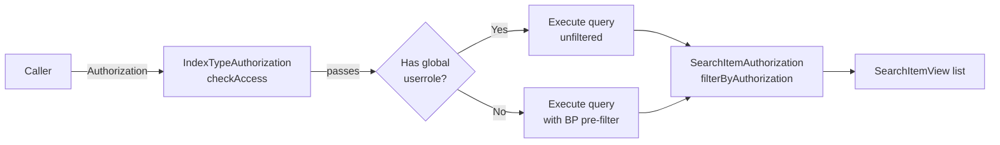

# Authorization

The client starter enforces access control at two levels: index type access (pre-check) and
document-level filtering (post-filter). Access is based on the roles declared on each `IndexType`
and the roles held by the caller.

## Authorization model



## IndexTypeAuthorization (pre-check)

Before executing the OpenSearch query, `IndexTypeAuthorization.checkAccess` verifies that the
caller's `Authorization` has at least one of the roles declared on the `IndexType`. If `auth` is
`null` or the role check fails, `IndexTypeAccessDeniedException` is thrown immediately without
touching OpenSearch.

## BP pre-filter

When the caller does not hold a global userrole for the index type but does hold a BP-scoped role
(e.g. `jme_read:BP:12345`), the query is automatically wrapped in a `bool` filter restricting
results to `origin.bp_id` values matching the caller's authorised business partners. This keeps
the pre-filter tight and avoids fetching unauthorized documents from OpenSearch.

## SearchItemAuthorization (post-filter)

After the query executes, `SearchItemAuthorization.filterByAuthorization` applies a final
item-level filter using the latest version's roles. Items that the caller cannot access are
silently removed from the result list.

## Authorization object

`Authorization` carries the caller's roles in two forms:

| Method                                                 | Returns                                                                                       |
|--------------------------------------------------------|-----------------------------------------------------------------------------------------------|
| `hasUserroleAnyOf(Set<String> roles)`                  | `true` if the caller holds at least one of the given roles as a global userrole.              |
| `getAllBusinessPartnerIdsWithAnyOf(Set<String> roles)` | Set of BP IDs for which the caller holds at least one of the given roles as a BP-scoped role. |

## UserSearchItemAuthorization

In Spring Security-integrated services, inject `UserSearchItemAuthorization` to obtain the
current user's `Authorization` automatically:

```java
@Autowired UserSearchItemAuthorization userAuth;

// Manual use
Authorization auth = userAuth.getUserAuthorization();
searchItemClient.searchMultiVersion(indexTypes, query, auth);

// Or let the client pull it automatically
searchItemClient.searchMultiVersionWithUserAuth(indexTypes, query);
```

`UserSearchItemAuthorization` is auto-configured when the
`JeapSecurityAuthorizationAutoConfiguration` is on the classpath (part of `jeap-spring-boot-starters`).

## Bypassing authorization

Use `searchMultiVersionUnchecked` only for trusted internal callers (background jobs, admin
endpoints) where access control is enforced at a higher layer:

```java
List<SearchItemView> results = searchItemClient.searchMultiVersionUnchecked(indexTypes, query);
```

## Related

- [Getting started](getting-started.md)
- [SearchItemClient](search-item-client.md)
- [jeap-opensearch-client-starter](../README.md)
